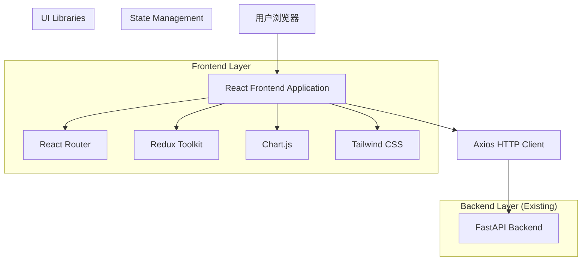
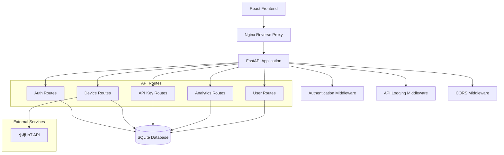

# 前端管理系统重构技术架构文档

## 1. Architecture design



## 2. Technology Description

**Frontend Stack:**

* React\@18 + TypeScript\@5

* Vite\@5 (构建工具)

* React Router\@6 (路由管理)

* Redux Toolkit\@2 (状态管理)

* Tailwind CSS\@3 (样式框架)

* Axios\@1 (HTTP客户端)

* Chart.js\@4 (图表库)

* React Hook Form\@7 (表单管理)

* React Query\@5 (服务端状态管理)

* Framer Motion\@11 (动画库)

**Development Tools:**

* ESLint + Prettier (代码规范)

* Husky + lint-staged (Git钩子)

* Vitest (单元测试)

* Storybook (组件文档)

**Backend:** 保持现有FastAPI架构不变

## 3. Route definitions

| Route            | Purpose           |
| ---------------- | ----------------- |
| /                | 重定向到仪表板或登录页面      |
| /login           | 用户登录页面            |
| /register        | 用户注册页面            |
| /dashboard       | 仪表板主页，显示系统概览和快速操作 |
| /devices         | 设备管理页面，管理小米设备     |
| /devices/:id     | 设备详情页面，查看和编辑特定设备  |
| /api-keys        | API密钥管理页面         |
| /api-keys/:id    | API密钥详情页面         |
| /mi-accounts     | 小米账户管理页面          |
| /mi-accounts/:id | 小米账户详情页面          |
| /analytics       | 数据分析页面，显示统计图表     |
| /profile         | 个人资料页面，用户信息和设置    |
| /docs            | API文档和使用指南        |
| /settings        | 系统设置页面（管理员）       |

## 4. API definitions

### 4.1 Core API

**认证相关API (保持现有接口不变)**

```
POST /api/v1/auth/login
POST /api/v1/auth/register
POST /api/v1/auth/logout
POST /api/v1/auth/verify
GET /api/v1/auth/me
```

**设备管理API**

```
GET /api/v1/devices
POST /api/v1/devices
GET /api/v1/devices/{device_id}
PUT /api/v1/devices/{device_id}
DELETE /api/v1/devices/{device_id}
```

**API密钥管理API**

```
GET /api/v1/api-keys
POST /api/v1/api-keys
DELETE /api/v1/api-keys/{key_id}
PUT /api/v1/api-keys/{key_id}
```

**数据分析API**

```
GET /api/v1/analytics/overview
GET /api/v1/analytics/trends
GET /api/v1/analytics/logs
```

### 4.2 Frontend API Client

**TypeScript类型定义**

```typescript
// 用户类型
interface User {
  id: number;
  username: string;
  email: string;
  display_name?: string;
  is_active: boolean;
  created_at: string;
}

// 设备类型
interface Device {
  id: string;
  name: string;
  device_id: string;
  device_type: string;
  status: 'online' | 'offline' | 'unknown';
  last_seen?: string;
  user_id: number;
}

// API密钥类型
interface ApiKey {
  id: number;
  name: string;
  key: string;
  is_active: boolean;
  created_at: string;
  last_used?: string;
  usage_count: number;
}

// 统计数据类型
interface AnalyticsData {
  total_calls: number;
  success_rate: number;
  avg_response_time: number;
  error_count: number;
  trend_data: TrendPoint[];
}

interface TrendPoint {
  timestamp: string;
  calls: number;
  success_rate: number;
}
```

## 5. Server architecture diagram



## 6. Data model

### 6.1 Frontend State Management

**Redux Store结构**

```typescript
interface RootState {
  auth: AuthState;
  devices: DevicesState;
  apiKeys: ApiKeysState;
  analytics: AnalyticsState;
  ui: UIState;
}

interface AuthState {
  user: User | null;
  token: string | null;
  isAuthenticated: boolean;
  loading: boolean;
}

interface DevicesState {
  devices: Device[];
  selectedDevice: Device | null;
  loading: boolean;
  error: string | null;
}

interface ApiKeysState {
  keys: ApiKey[];
  loading: boolean;
  error: string | null;
}

interface AnalyticsState {
  overview: AnalyticsData | null;
  trends: TrendPoint[];
  logs: ApiCallLog[];
  loading: boolean;
}

interface UIState {
  theme: 'light' | 'dark';
  sidebarCollapsed: boolean;
  notifications: Notification[];
}
```

### 6.2 Component Architecture

**组件层次结构**

```
App
├── Router
├── Layout
│   ├── Header
│   │   ├── UserMenu
│   │   ├── ThemeToggle
│   │   └── NotificationCenter
│   ├── Sidebar
│   │   ├── Navigation
│   │   └── UserInfo
│   └── Main
│       └── PageContent
├── Pages
│   ├── LoginPage
│   ├── RegisterPage
│   ├── DashboardPage
│   │   ├── StatsCards
│   │   ├── QuickActions
│   │   └── RecentActivity
│   ├── DevicesPage
│   │   ├── DeviceList
│   │   ├── DeviceCard
│   │   └── DeviceModal
│   ├── ApiKeysPage
│   ├── AnalyticsPage
│   │   ├── ChartContainer
│   │   ├── FilterPanel
│   │   └── LogsTable
│   └── ProfilePage
└── Components
    ├── UI
    │   ├── Button
    │   ├── Input
    │   ├── Modal
    │   ├── Table
    │   └── Chart
    ├── Forms
    │   ├── LoginForm
    │   ├── DeviceForm
    │   └── ApiKeyForm
    └── Common
        ├── LoadingSpinner
        ├── ErrorBoundary
        └── ProtectedRoute
```

### 6.3 Build and Deployment

**构建配置**

```typescript
// vite.config.ts
export default defineConfig({
  plugins: [react()],
  build: {
    outDir: 'dist',
    sourcemap: true,
    rollupOptions: {
      output: {
        manualChunks: {
          vendor: ['react', 'react-dom'],
          router: ['react-router-dom'],
          ui: ['@headlessui/react', 'framer-motion'],
          charts: ['chart.js', 'react-chartjs-2']
        }
      }
    }
  },
  server: {
    proxy: {
      '/api': {
        target: 'http://localhost:8000',
        changeOrigin: true
      }
    }
  }
});
```

**部署策略**

* 开发环境：Vite开发服务器 + 热重载

* 生产环境：静态文件部署到Nginx

* API代理：Nginx反向代理到FastAPI后端

* 资源优化：代码分割、懒加载、压缩

**环境配置**

```typescript
// .env.development
VITE_API_BASE_URL=http://localhost:8000/api/v1
VITE_APP_TITLE=小爱音箱API管理平台

// .env.production
VITE_API_BASE_URL=/api/v1
VITE_APP_TITLE=小爱音箱API管理平台
```

