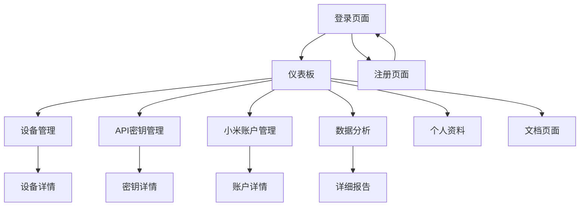

# 前端管理系统重构产品需求文档

## 1. Product Overview

本项目旨在将小爱音箱API多用户平台的前端系统从基础HTML/CSS/JavaScript架构升级为现代化的React单页应用，提供更好的用户体验、代码可维护性和开发效率。

当前系统使用传统的多页面HTML架构，存在代码重复、状态管理困难、用户体验不够流畅等问题。通过重构为React应用，将实现组件化开发、统一状态管理、更好的响应式设计和现代化的UI界面。

项目目标是在保持现有功能完整性的基础上，提升系统的技术先进性和用户体验，为后续功能扩展奠定坚实基础。

## 2. Core Features

### 2.1 User Roles

| Role | Registration Method | Core Permissions            |
| ---- | ------------------- | --------------------------- |
| 普通用户 | 邮箱注册                | 可管理个人设备、API密钥、小米账户，查看个人数据分析 |
| 管理员  | 系统分配                | 拥有所有用户权限，可查看全局统计数据，管理系统配置   |

### 2.2 Feature Module

我们的前端重构需求包含以下主要页面：

1. **登录注册页面**：用户认证、账户注册、密码重置功能
2. **仪表板页面**：系统概览、快速操作、统计摘要
3. **设备管理页面**：小米设备列表、设备配置、设备状态监控
4. **API密钥管理页面**：密钥生成、权限配置、使用统计
5. **小米账户管理页面**：账户绑定、认证状态、账户信息
6. **数据分析页面**：调用统计、成功率分析、趋势图表
7. **个人资料页面**：用户信息编辑、偏好设置、安全配置
8. **文档页面**：API文档、使用指南、常见问题

### 2.3 Page Details

| Page Name | Module Name | Feature description              |
| --------- | ----------- | -------------------------------- |
| 登录注册页面    | 用户认证模块      | 实现邮箱登录、用户注册、密码重置、记住登录状态、表单验证     |
| 登录注册页面    | 主题切换        | 支持明暗主题切换，保存用户偏好设置                |
| 仪表板页面     | 概览统计        | 显示API调用总数、成功率、设备数量、最近活动等关键指标     |
| 仪表板页面     | 快速操作        | 提供常用功能快捷入口，如添加设备、生成API密钥等        |
| 仪表板页面     | 活动日志        | 显示最近的系统活动和操作记录                   |
| 设备管理页面    | 设备列表        | 展示用户绑定的小米设备，支持搜索、筛选、分页           |
| 设备管理页面    | 设备操作        | 支持设备添加、删除、重命名、状态查看               |
| 设备管理页面    | 批量操作        | 支持批量选择设备进行操作                     |
| API密钥管理页面 | 密钥管理        | 创建、删除、重新生成API密钥，设置权限和有效期         |
| API密钥管理页面 | 使用统计        | 显示每个密钥的调用次数、成功率等统计信息             |
| API密钥管理页面 | 安全设置        | 配置IP白名单、访问限制等安全选项                |
| 小米账户管理页面  | 账户绑定        | 添加、删除小米账户，管理账户认证状态               |
| 小米账户管理页面  | 账户信息        | 显示账户详情、设备列表、认证状态                 |
| 数据分析页面    | 统计图表        | 使用Chart.js展示API调用趋势、成功率变化、设备使用情况 |
| 数据分析页面    | 数据筛选        | 支持按时间范围、设备、API类型等维度筛选数据          |
| 数据分析页面    | 调用日志        | 详细的API调用记录，支持搜索和导出               |
| 个人资料页面    | 信息编辑        | 修改用户基本信息、联系方式、显示名称               |
| 个人资料页面    | 安全设置        | 修改密码、启用两步验证、查看登录历史               |
| 文档页面      | API文档       | 完整的API接口文档，包含示例代码和参数说明           |
| 文档页面      | 使用指南        | 平台使用教程、最佳实践、故障排除                 |

## 3. Core Process

### 用户主要操作流程

**新用户注册流程：**
用户访问登录页面 → 点击注册链接 → 填写注册信息 → 邮箱验证 → 登录成功 → 进入仪表板 → 绑定小米账户 → 添加设备 → 生成API密钥 → 开始使用

**日常使用流程：**
用户登录 → 查看仪表板概览 → 根据需要访问各功能模块 → 查看数据分析 → 管理设备和密钥 → 退出登录

**设备管理流程：**
进入设备管理页面 → 查看现有设备列表 → 添加新设备或管理现有设备 → 配置设备参数 → 测试设备连接 → 保存设置

## 4. User Interface Design

### 4.1 Design Style

**主色调：**

* 主色：#4f46e5 (现代紫色)

* 辅助色：#10b981 (成功绿色)

* 警告色：#f59e0b (橙色)

* 错误色：#ef4444 (红色)

**按钮样式：**

* 圆角设计 (8px border-radius)

* 悬停效果和阴影

* 渐变背景和微动画

**字体设计：**

* 主字体：-apple-system, BlinkMacSystemFont, 'Segoe UI', Roboto

* 标题字体大小：24px-32px

* 正文字体大小：14px-16px

**布局风格：**

* 卡片式设计，使用阴影和圆角

* 左侧导航栏 + 主内容区域

* 响应式网格布局

* 明暗主题切换支持

**图标样式：**

* 使用Font Awesome图标库

* 统一的图标大小和颜色

* 支持主题色彩变化

### 4.2 Page Design Overview

| Page Name | Module Name | UI Elements                   |
| --------- | ----------- | ----------------------------- |
| 登录注册页面    | 认证表单        | 居中卡片布局，渐变背景，表单验证提示，主题切换按钮     |
| 仪表板页面     | 统计卡片        | 4列网格布局，彩色图标，数字动画效果，Chart.js图表 |
| 仪表板页面     | 快速操作        | 按钮网格，悬停效果，图标 + 文字组合           |
| 设备管理页面    | 设备列表        | 表格布局，搜索框，筛选器，分页组件，操作按钮        |
| 设备管理页面    | 设备卡片        | 卡片式展示，设备状态指示器，操作菜单            |
| API密钥管理页面 | 密钥列表        | 表格布局，复制按钮，状态标签，创建按钮           |
| 数据分析页面    | 图表区域        | Chart.js响应式图表，时间选择器，数据筛选器     |
| 数据分析页面    | 统计面板        | 指标卡片，趋势箭头，颜色编码                |

### 4.3 Responsiveness

**响应式设计策略：**

* 桌面优先设计，向下兼容移动端

* 断点设置：768px (平板), 1024px (桌面)

* 移动端侧边栏折叠为汉堡菜单

* 表格在小屏幕上转换为卡片布局

* 触摸友好的按钮大小 (最小44px)

* 支持手势操作和触摸滑动

